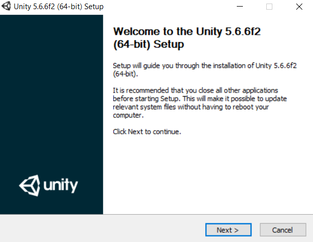

# Вступление
Данная статья создана в публичных целях для подробного объяснения работы движка и его установки.

В частности данный репозиторий создан для моей команды в качестве небольшой шпаргалки по использованию. Надеюсь она поможет :blush:

## Установка
- Переходим на официальный сайт Unity, скачиваем Unity   2017.1.0 либо 2018.3.0

https://unity3d.com/ru/get-unity/download/archive

-  После скачивания инсталлятора, начинается процесс установки, тут нажимаем везде кнопку далее.

### Начало работы с проектами Kee & VL 

### Test

|pair|single|
|:---:|:---:|
||
